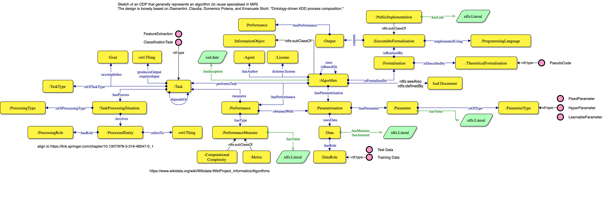

# Music Algorithm Ontology
An ontology to describe music algorithms, their implementation and results

[](https://zenodo.org/badge/latestdoi/372536364)
[](https://creativecommons.org/licenses/by/4.0/)

The Music Algorithm module formalises algorithms that can operate on music metadata (using the [``Music Meta``](https://github.com/polifonia-project/music-meta-ontology) module), and musical content (via the [``Music Representation``](https://github.com/polifonia-project/music-representation-ontology) module). The module commitments are similar to those defined by Diamantini et al. in [1]. Indeed, an algorithm is characterised by three main components: a formalisation, which can be theoretical (e.g. pseudocode) or executable (e.g. using a programming language); a parametrisation (e.g. input data); and the kind of task it solves. The latter defines a set of entities that are processed alongside the input and output data requirements and the final goal achieved. The module allows theoretical and quantitative performances to be represented in the context of the algorithm’s parametrisation.



Through an abstract and general definition, the formalisation in Music Algorithm can be seen as a general pattern, capable of representing any algorithm regardless of the domain of application. In the context of music, the output of the algorithm is considered an analysis, which is then represented via the Representation module.


## Examples

Expressing an audio-based music similarity. 

```
PREFIX mm: <Music meta module>
PREFIX mr: <Music representation module>
PREFIX ma: <Music algorithm module>

ma:MFCCAudioFeatures rdfs:subClassOf ma:ComputationalAnalysis .

A a mm:MusicEntity .
A mr:hasAnnotation [
  :hasAnnotationContent [
    :hasSubject AudioFeaturesOfA
] .

AudioFeaturesOfA a ma:MFCCAudioFeatures .
LibrosaMFCCExtractor a ma:ExecutableFormalisation ;
                     ma:outputs AudioFeaturesOfA .

B a mm:MusicEntity .
B mr:hasAnnotation [
  :hasAnnotationContent [
    :hasSubject AudioFeaturesOfB
] .

AudioFeaturesOfB a ma:MFCCAudioFeatures .
LibrosaMFCCExtractor a ma:ExecutableFormalisation ;
                     ma:outputs AudioFeaturesOfB .

ma:AudioSignalSimilarityTask a ma:Task ;
  ma:requiresInput ma:AudioSignal ;
  ma:producesOutput xsd:float ;
  ma:accomplishes ma:MusicSimilarity ;
  ma:isOfTaskType ma:Similarity ;
  ma:hasProcess [
    ma:isOfProcessingType ma:SignalComparison ;
    ma:involves [
      ma:refersTo ma:AudioSignal ;
      ma:hasRole ma:pairwise_similarity_source ;
    ] ;
    ma:involves [
      ma:refersTo ma:AudioSignal ;
      ma:hasRole ma:pairwise_similarity_target ;
    ]
  ]

Librosa_MFCC_SSM_Algorithm a ma:Algorithm ;
  ma:performsTask ma:SSM_MFCC_SimilarityTask ;
  ma:hasParametrisation [
    ma:usesData [
      ma:involves ma:MFCCAudioFeatures ;
      ma:hasRole ma:pairwise_similarity_source
    ] ;
    ma:usesData [
      ma:involves ma:MFCCAudioFeatures ;
      ma:hasRole ma:pairwise_similarity_source
    ] ;
  ] .


SimAtoB a ma:ComputationalAnalysis ;
  mr:hasAnnotation [
    mr:hasAnnotator Librosa_MFCC_SSM_Algorithm ;
    mr:hasAnnotationType ma:Similarity ;
    mr:hasAnnotationContent [ mr:hasSubject 0.8^^xsd:float ] . ;
  ] ;

A mr:hasAnnotation [
    mr:derivesFrom SimAtoB ;
    mr:hasAnnotator Librosa_MFCC_SSM_Algorithm ;
    mr:hasAnnotationType ma:pairwise_similarity_source ;
    mr:describes [
      mr:hasTemporalLocation [ # Not sure if the predicates are this ones - should check but the idea is that the temporal location is the whole piece
        mr:start 0
        mr:end 100
      ]
    ] ;
]

B mr:hasAnnotation [
    mr:derivesFrom SimAtoB ;
    mr:hasAnnotator Librosa_MFCC_SSM_Algorithm ;
    mr:hasAnnotationType ma:pairwise_similarity_target ;
    mr:describes [
      mr:hasTemporalLocation [ # Not sure if the predicates are this ones - should check but the idea is that the temporal location is the whole piece
        mr:start 0
        mr:end 100
      ]
    ] ;
  ].
```

## License

This work is licensed under a [Creative Commons Attribution 4.0 International License][http://creativecommons.org/licenses/by/4.0/].

## References

[1]: Diamantini, C., Potena, D., Storti, E.: Ontology-driven kdd process composition. In: Advances in Intelligent Data Analysis VIII: 8th International Symposium on Intelligent Data Analysis, IDA 2009, Lyon, France, August 31-September 2, 2009. Proceedings 8. pp. 285–296. Springer (2009)
